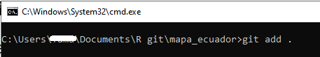
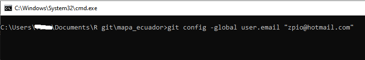
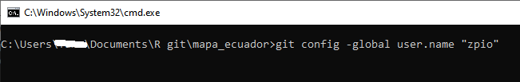

🦄 Apuntes Introductorio de Git y GitHub
===========================================

- [Qué es Git?](#git)
- [Descargar e Instalar Git](#instalar-git)
- [Las áreas principales de Git](#areas-git)
- [Directorio de trabajo (working directory)](#directorio)
- [Abrir el Intérprete de Comandos cmd](#cmd)
- [Crear un nuevo REPOSITORIO con `git init`](#git-init)
- [Inspección del repositorio con `git status`](#git-status)
- [Agregar archivos o cambios al repositorio con `git add`](#git-add)
- [Crear un commit del repositorio con `git commit`](#git-commit)
- [Ver historial de commits con `git log`](#git-log)
- [Que es GitHub?](#github)
- [Publicar un repositorio Git en GitHub](#repo-github)
- [Clonar un repositorio de GitHub](#git-clone)
- [ Referencia](#referencia)


🔥 Qué es Git? <a name="git"></a>
---------------------------------


Git es un software de **control de versiones** distribuido. El control de versiones es una forma de guardar cambios a lo largo del tiempo sin sobrescribir versiones anteriores.

Estar distribuido significa que cada desarrollador que trabaja con un **repositorio** de Git tiene una copia de ese repositorio completo: cada confirmación, cada rama, cada archivo.

El control de versiones es muy importante; sin él, corre el riesgo de perder su trabajo. Con Git, puede hacer una "confirmación (**commit**)", o punto de guardado, con la frecuencia que desee. También puede volver a las confirmaciones (commits) anteriores. Esto le quita la presión mientras trabaja.


🔥 Descargar e Instalar Git <a name="instalar-git"></a>
--------------------------------------

Descargar e instalar Git es como instalar cualquier otro programa, debe seguir el asistente de instalación.

https://git-scm.com/downloads


🔥 Las áreas principales de Git <a name="areas-git"></a>
----------------------------------------


Crear un **proyecto** en Git tiene tres areas principales: el directorio de trabajo (**Working Directory**), el área de preparación (**Staging Area**), el directorio de Git (**Git directory**).

El **flujo de trabajo** básico en Git es algo así:

1.	Modificas una serie de archivos en tu directorio de trabajo (**Working Directory**).

2.	Preparas los archivos, añadiéndolos a tu área de preparación (**Staging Area**).

3.	Confirmas (**commit**) los cambios, se toma los archivos tal y como están en el área de preparación y almacena esa **copia instantánea** de manera permanente en el directorio de Git (**Git directory**).

Si una versión concreta de un archivo está en el directorio de Git, se considera confirmada (**committed**).

Si ha sufrido cambios desde que se obtuvo del repositorio, pero ha sido añadida al área de preparación, está preparada (**Staged**). 

Y si ha sufrido cambios desde que se obtuvo del repositorio, pero no se ha preparado, está modificada (**Modified**).


🔥 Directorio de trabajo (working directory) <a name="directorio"></a>
-----------------------------------------------

Un Directorio de trabajo es una **carpeta** en el ordenador con nuestros **archivos** de trabajo que ya venimos trabajando. O una **carpeta vacía** donde vamos empezar el proyecto desde cero. Por Ejemplo:


Supongamos que ya hemos venido trabajando en un proyecto y tenemos varios archivos en esa carpeta. Por ejemplo:


🔥 Abrir el Intérprete de Comandos cmd <a name="cmd"></a>
-----------------------------------------------

Para empezar a controlar y dar seguimiento a nuestros proyectos y archivos debe abrir el **intérprete de comandos cmd** desde la carpeta de trabajo para poder iniciar Git.


Se abrirá la clásica ventana negra, indicando que esta lista para escribir comandos. 


La ventana del **cmd** nos indicará la ruta del directorio de trabajo seguido de un guión (\_) parpadeante, indicándonos que esta listo para que escribamos comandos.


🔥 Crear un nuevo REPOSITORIO con `git init` <a name="git-init"></a>
-----------------------------------------------
El comando `git init` crea un **nuevo repositorio** de Git. Puede utilizarse para convertir un proyecto existente y sin versión en un repositorio de Git, o para inicializar un nuevo repositorio vacío. 

```
git init
```


Al escribir `git init` internamente se crea dos areas: **Staging Area (área de preparación)** y **.git directory (o Repositorio Local)**.

Esto lo podemos verificar por que en la carpeta de nuestro ordenador donde tenemos el proyecto se agrega una carptea oculta .git.


🔥 Inspección de nuestro repositorio con `git status` <a name="git-status"></a>
-----------------------------------------------------

El comando `git status` proporcionará **información** si tiene archivos **nuevos** o **modificados** y que aún no se han confirmado (**committed**).

Supongamos que hemos agregado un nuevo archivo a nuestra carpeta de directorio de trabajo, `git status` mostrará esa información en color **rojo**.

```
git status
```


🔥 Agregar archivos o cambios al repositorio con `git add` <a name="git-add"></a>
--------------------------------------------------------

El comando `git add` **agrega** archivos **nuevos** o **modificados** de su directorio de trabajo al área de **preparación** de Git (**Staging Area**).

Puedes agregar todos archivos o cambios de un solo golpe o uno por uno. Con `git add .` (punto) agrega todos los archivos nuevos y las modificaciones de golpe. Con `git add nombre del archivo` (ej. git add licencia.txt) agregas de forma individual.




🔥 Crear un commit del repositorio con `git commit` <a name="git-commit"></a>
---------------------------------------------------

El comando `git commit` crea una confirmación (commit), que es como una **copia instantánea** del repositorio en un momento específico. En el tiempo, las confirmaciones (commits) deben contar un historial del repositorio. Las confirmaciones (commits) incluyen muchos metadatos además del contenido y el mensaje, como el autor, la marca de tiempo y más.

Si nunca has usado git y es la primera vez que lo instalas en tu ordenador, el primer commit te pedirá que te identifique con un correo y un nombre. El primer commit en este caso particular no se ejecutará aún.


Para esto debes escribir los siguientes comandos en el cmd:

Primero:
```
git config –global user.email “zpio@hotmail.com”
```


Luego:
```
git config –global user.name “zpio”
```



Nuevamente tendremos que ejecutar `git commit` pero ahora le agregaremos un mensaje descriptivo con `git commit -m “descripción del mensaje”`
```
git commit -m “inicio del proyecto”
```


Mostrará el mensaje de los cambios que hayamos hecho en nuestros archivos.

🔥 Para futuras modificaciones
--------------------------------------------

Si en los dias posteriores hacemos nuevos cambios en nuestros archivos o agregamos nuevos archivos o creamos nuevas carpetas, para guardar los cambios en nuestro repositorio de Git hay que seguir los mismo pasos con excepcion que ya no usaremos el comando `git init` porque el repositorio ya esta creado, ni tampoco tenemos que poner nuestro correo y nombre porque ya no los pedirán. 

Los pasos serian:

```
git status
```
```
git add .
```
```
git commit -m 'mensaje del commit'
```

🔥 Ver historial de commits con `git log` <a name="git-log"></a>
--------------------------------------------
El comando `git log` da lista de los commits hechos sobre ese repositorio en orden cronológico inverso, las más recientes se muestran al principio, esta muestra un Identificador del commit, Autor, Fecha de realización, Mensaje enviado.

Tambien podemos usar `git log --oneline`


----------------------------------------

🔥 Que es GitHub? <a name="github"></a>
----------------------------------------

GitHub es un sitio web para alojar proyectos utilizando el sistema de control de versiones Git.

Se trata de una de las principales plataformas para crear proyectos abiertos de herramientas y aplicaciones, y se caracteriza sobre todo por sus funciones colaborativas que ayudan a que todos puedan aportar su granito de arena para mejorar el código.

La plataforma está creada para que los desarrolladores suban el código de sus aplicaciones y herramientas, y que como usuario no sólo puedas descargarte la aplicación, sino también entrar a su perfil para leer sobre ella o colaborar con su desarrollo.

Tambien sirve para respaldar en la nube tus proyectos en caso que se dañe tu ordenador.

Primero hay que crearse una cuenta como cualquier red social.


🔥 Publicar un repositorio Git en GitHub <a name="repo-github"></a>
--------------------------------------------------------

Para publicar un repositorio en GitHub debe seguir los siguientes pasos:

**Primero: crear un repositorio en GitHub**


Agregamos un nombre al repositorio, no necesariamente debe tener el mismo nombre de la carpeta en la que trabajamos desde el ordenador.


Preferiblemente no darle check a la seccion de **Add a README file** para que salga la siguiente guia:


**Segundo: Subir el repositorio Git a GitHub**

Debemos ejecutar los comandos que estan en el rectangulo azul en el cmd para poder subir nuestro repositorio Git a GitHub:

```
git remote add origin https://github.com/zpio/mapa_ecuador_prueba.git
```
El comando `git remote` solo debe ejecutarse solo una vez para subir el repositorio a GitHub. Para futuras modificaciones en el repositorio y subirlo a GitHub ya no se debe ejecutar `git remote`.

```
git branch -M main
```
El comando `git branch -M main` debe ejecutarse debido a un cambio en la plataforma de GitHub, donde hay que crear una rama llamada `main`.
```
git push -u origin main
```
El comando `git push` publica los cambios de nuestro repositorio a GitHub.


Al ejecutar `git push -u origin main` nos pedirá hacer login en GitHub.


Una vez hecho login en GitHub ya se subirá el repositorio a GitHub.


**Nota:**

Los repositorios nuevos que se creen empezarán a mostrar **main** como rama principal y tendrán que hacer sus comandos respectivos allí. Antes había que apuntar a la rama **Master**. También se agrega un paso adicional, al momento de crear un repositorio desde la línea de comandos. Sabemos que **git branch** nos ayuda a crear una nueva rama dentro de nuestro repositorio y **-M** nos ayudará a mover todo el historial que tengamos (en caso de que los haya) en **master** a la nueva rama que estamos creando que se llama **main**.


🔥 Para futuras modificaciones
--------------------------------------------
Si en los dias posteriores hacemos nuevos commits del repositorio Git, para subirlo a GitHub ya no debe ejecutarse ni `git remote` ni `git branch -M main` solo debe ejecutarse `git push`. En resumen seria asi:

```
git status
```
```
git add .
```
```
git commit -m 'mensaje del commit'
```
Y para subir a GitHub solo ejecutar:
```
git push
```

🔥 Clonar un repositorio de GitHub <a name="git-clone"></a>
------------------------------------------

Si deseas tener en un ordenador todo un repositorio de un proyecto de GitHub y trabajar sobre el, puedes usar el comando `git clone` seguido de una url del respositorio de GitHub.

Al clonar un repositorio se te crea una carpeta en tu ordenador con todos los archivos que tenga dicho repositorio. 

Primero debes decidi en que parte de tu ordenador quieres poner el repositorio a clonar y debes abrir el cmd:


Segundo debemos ir al sitio web del repositorio de GitHub:

https://github.com/zpio/mapa-ecuador

En la seccion de `code` esta la URL que necesitas para clonar el repositorio:

https://github.com/zpio/mapa-ecuador.git


En el cmd debes escribir `git clone` seguido de la url:

```
git clone https://github.com/zpio/mapa-ecuador.git
```


En tu carpeta aparecerá la carpeta de todo el repositorio.

-------------------------------------------------------------

🔥 Referencia <a name="referencia"></a>
==================================
https://github.com/git-guides/

https://git-scm.com/book/es/v2

https://www.youtube.com/watch?v=HiXLkL42tMU


