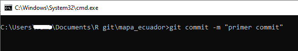

🦄 Apuntes Introductorio de Git y GitHub
===========================================

- [Qué es Git?](#git)
- [Descargar e Instalar Git](#instalar-git)
- [Las áreas principales de Git](#areas-git)
- [Directorio de trabajo (working directory)](#directorio)
- [Abrir el Intérprete de Comandos cmd](#cmd)
- [Inicializando un repositorio con `git init`](#git-init)
- [Inspección del repositorio con `git status`](#git-status)
- [Agregar archivos o cambios al repositorio con `git add`](#git-add)
- [Crear un commit del repositorio con `git commit`](#git-commit)
- [Ver historial de commits con `git log`](#git-log)
- [Que es GitHub?](#github)
- [Publicar un repositorio Git en GitHub](#repo-github)
- [Clonar un repositorio de GitHub](#git-clone)
- [ Referencia](#referencia)


🔥 Qué es Git? <a name="git"></a>
---------------------------------


Git es un software de **control de versiones** que sirve para guardar cambios en los archivos de un proyecto a lo largo del tiempo.

🔥 Descargar e Instalar Git <a name="instalar-git"></a>
--------------------------------------

Descargar e instalar Git es como instalar cualquier otro programa, debe seguir el asistente de instalación.

https://git-scm.com/downloads

🔥 Las áreas principales de Git <a name="areas-git"></a>
----------------------------------------


Git tiene tres areas principales: el Espacio de Trabajo, el área de Preparación (**Staging Area**) y el Repositorio.

El **flujo de trabajo** básico en Git:

1.	**Modificas o creas** una serie de archivos en el espacio de trabajo de tu maquina.

2.	**Preparas** los archivos, añadiéndolos al área de preparación (**Staging Area**).

3.	**Envias** los archivos preparados al repositorio git de tu maquina.

Si una versión concreta de un archivo está en el repositorio de Git, se considera confirmada (**committed**).

Si ha sufrido cambios desde que se obtuvo del repositorio, pero ha sido añadida al área de preparación, está preparada (**Staged**). 

Y si ha sufrido cambios desde que se obtuvo del repositorio, pero no se ha preparado, está modificada (**Modified**).


🔥 Espacio de trabajo <a name="directorio"></a>
-----------------------------------------------

El espacio de trabajo es la carpeta de tu proyecto con todos los **archivos** que estamos haciendo seguimiento. 


🔥 Abrir el Intérprete de Comandos cmd <a name="cmd"></a>
-----------------------------------------------

Para empezar a dar seguimiento a nuestros proyectos debe abrir el **intérprete de comandos cmd**. La opción facil de abrir el cmd es escribir `cmd` en la barra y enter)


Se abrirá la clásica ventana negra. 


La ventana del **cmd** indica la ruta del directorio de trabajo seguido de un guión (\_) parpadeante, indicándo que esta listo para que escriba comandos.

El siguiente paso es escribir `git init`

🔥 Inicializando un repositorio con `git init` <a name="git-init"></a>
-----------------------------------------------
El comando `git init` crea un **nuevo repositorio** de Git, es decir, converte nuestro proyecto sin versión en un repositorio de Git.

```
git init
```


Al escribir `git init` internamente se crea dos areas: **Staging Area (área de preparación)** y la carpeta oculta **.git** que es Area Repositorio.

Esto lo podemos verificar por que en la carpeta de nuestro ordenador donde tenemos el proyecto se agrega una carpeta oculta .git.


🔥 Inspección de nuestro repositorio con `git status` <a name="git-status"></a>
-----------------------------------------------------

El comando `git status` proporcionará **información** si tiene archivos **nuevos** o **modificados** y que aún no se han confirmado (**committed**).

Si se agrega un nuevo archivo, `git status` mostrará esa información en color **rojo** indicando que son archivos sin seguimiento.

```
git status
```


> **Nota:** Cuando se inicia un repositorio en Git se crea una "linea en el tiempo" llamada "**branch**" (rama) que va almacenando todo el historial. Esta rama se llama **MASTER**. 

🔥 Agregar archivos o cambios al repositorio con `git add` <a name="git-add"></a>
--------------------------------------------------------

El comando `git add` **agrega** archivos **nuevos** o **modificados** al área de **preparación** (**Staging Area**). Se puede agregar todos archivos o cambios de un solo golpe o uno por uno. 

El comando `git add .` agrega todos los archivos nuevos y modificados de golpe. El punto ( . ) indica que tome todos los archivos de la carpeta actual.

Con `git add [nombre del archivo]` (ej. `git add archivo.txt`) agregas archivos de forma individual.


Si ejecuta `git status` nuevamente veremos que los archivos ahora estan en color **verde** indicando que ya estan en **Staging Area** listo para la confirmación (commit). Además indica que son nuevos archivos **new file**. Si en este punto modificamos estos archivos y aplicamos nuevamente `git status` mostrará el estado: **modified**.


🔥 Crear un commit del repositorio con `git commit` <a name="git-commit"></a>
---------------------------------------------------

El comando `git commit -m "mensaje del commit"` crea una confirmación (commit) o **copia instantánea** del repositorio en un momento específico. Las confirmaciones (commits) incluyen muchos metadatos además del contenido y el mensaje, como el autor, la marca de tiempo y más.

```
git commit -m "Primer commit"
```
Hay que escribir un mensaje descriptivo: `git commit -m "descripción del mensaje"`

Si nunca has usado git y es la primera vez que lo instalas en tu ordenador, el primer commit te pedirá que te identifique con un correo y un nombre. El primer commit en este caso particular no se ejecutará aún.




Para esto debes escribir los siguientes comandos en el cmd:

Primero:
```
git config --global user.email "zpio@hotmail.com"
```


Luego:
```
git config --global user.name "zpio"
```


Nuevamente tendremos que ejecutar `git commit` pero ahora le agregaremos un mensaje descriptivo con `git commit -m "descripción del mensaje"`
```
git commit -m "primer commit"
```


Mostrará el mensaje con la confirmación de los cambios que hayamos hecho en nuestros archivos.

🔥 Ver historial de commits con `git log` <a name="git-log"></a>
--------------------------------------------
El comando `git log` da una lista de commits hechos sobre ese repositorio en orden cronológico inverso, las más recientes se muestran al principio, esta muestra un Identificador del commit, Autor, Fecha de realización, Mensaje enviado.

Tambien podemos usar `git log --oneline`


🔥 Nuevos commits
--------------------------------------------

Si en dias posteriores hacemos nuevos cambios en nuestros archivos o agregamos nuevos archivos o creamos nuevas carpetas, para guardar los cambios en nuestro repositorio de Git hay que seguir los mismo pasos con excepcion que ya no usaremos el comando `git init` porque el repositorio ya esta creado, ni tampoco tenemos que poner nuestro correo y nombre porque ya no los pedirán. 

Los pasos serian:

```
git status
```
```
git add .
```
```
git commit -m 'segundo commit'
```
```
git log
```

A continuacion presento un ejemplo donde hemos agregado dos archivos mas a nuestro carpeta local y veremos que Git nos indicará que debemos agregar estos nuevos archivos al repositorio de Git.

```
git status
```


```
git add .
```


```
git status
```


```
git log --oneline
```
```
git log
```


En cada confirmación de cambios (**commit**), Git almacena una instantánea de tu trabajo preparado.

----------------------------------------

🔥 Que es GitHub? <a name="github"></a>
----------------------------------------

GitHub es un sitio web para alojar proyectos utilizando el sistema de control de versiones Git.

Primero hay que crearse una cuenta como cualquier red social.


🔥 Publicar un repositorio Git en GitHub <a name="repo-github"></a>
--------------------------------------------------------

Para publicar un repositorio en GitHub debe seguir los siguientes pasos:

**Primero: crear un repositorio en GitHub**


Agregamos un nombre al repositorio, no necesariamente debe tener el mismo nombre de la carpeta en la que trabajamos desde el ordenador.


Preferiblemente no darle check a la seccion de **Add a README file** para que salga la siguiente guia:


**Segundo: Subir el repositorio Git a GitHub**

Debemos ejecutar los comandos que estan en el rectangulo azul en el cmd para poder subir nuestro repositorio Git a GitHub.

El comando `git remote add origin https://github.com/zpio/mapa_ecuador_prueba.git` solo debe ejecutarse solo una vez para subir el repositorio a GitHub. Para futuras modificaciones en el repositorio y subirlo a GitHub ya no se debe ejecutarse.
```
git remote add origin https://github.com/zpio/mapa_ecuador_prueba.git
```
Lo que hace `git remote add origin [url]` es añadir un repositorio de la nube (github) a nuestro repositorio local.

**쯊e acuerdas que nuestra rama principal se llama MASTER?** Pues ahora la vamos a renombrar a "**main**" debido a un cambio en la plataforma de GitHub. Para logralo hay que usar el comando `git branch -M main` para forzar el cambio de nombre.

```
git branch -M main
```

El comando `git push` publica o sube los cambios de nuestro repositorio local a GitHub. 
```
git push -u origin main
```
Si es la primera vez que subimos un repositorio a GitHub, al ejecutar `git push -u origin main` nos pedirá hacer login en GitHub.


Una vez hecho login en GitHub ya se subirá el repositorio a GitHub.


Al actualizar la pagina de github aparecerá asi:


🔥 Para futuras modificaciones
--------------------------------------------
Si en los dias posteriores hacemos nuevos cambios y commits del proyecto, para subir los cambios a GitHub ya no debe ejecutarse ni `git remote` ni `git branch -M main` solo debe ejecutarse `git push origin main`. En resumen seria asi:

```
git status
```
```
git add .
```
```
git commit -m 'mensaje del commit'
```
Y para subir a GitHub solo ejecutar:
```
git push origin main
```

🔥 Clonar un repositorio de GitHub <a name="git-clone"></a>
------------------------------------------

Si deseas tener en un ordenador todo un repositorio de un proyecto de GitHub y trabajar sobre el, puedes usar el comando `git clone` seguido de una url del respositorio de GitHub.

Al clonar un repositorio se te crea una carpeta en tu ordenador con todos los archivos que tenga dicho repositorio. 

Primero debes decidir en que parte de tu ordenador quieres poner el repositorio a clonar y debes abrir el cmd:


Segundo debemos ir al sitio web del repositorio de GitHub:

https://github.com/zpio/mapa-ecuador

En la seccion de `code` esta la URL que necesitas para clonar el repositorio:

https://github.com/zpio/mapa-ecuador.git


En el cmd debes escribir `git clone` seguido de la url:

```
git clone https://github.com/zpio/mapa-ecuador.git
```


En tu directorio de trabajo aparecerá la carpeta de todo el repositorio.


Esto es la parte introductoria, hay mucho contenido que revisar.

-------------------------------------------------------------

🔥 Referencia <a name="referencia"></a>
==================================

Libro de Git: https://git-scm.com/book/es/v2

Documentacion de Git y GitHub https://github.com/git-guides/


